<div align="center">

# 🌀 S.O.N.A.R

### **Sonic Oracle for Navigating Ancient Ruins**

*Listening to the past, one frequency at a time*

[](https://www.kaggle.com/competitions/openai-to-z-challenge)
[](https://www.kaggle.com/code/arnavmishra6996/whispers-beneath-the-canopy)
[](LICENSE)
[](https://www.python.org/)

---

</div>

## 🎯 What is SONAR?

**SONAR** is a groundbreaking AI system that "listens" to the Amazon rainforest to discover hidden archaeological sites. By converting satellite data, LiDAR terrain models, and hydrological patterns into sound, it uses machine learning to detect acoustic anomalies that reveal ancient structures invisible to traditional remote sensing.

<div align="center">

### 🔊 The Innovation

| Traditional Approach | SONAR Approach |
|:-------------------:|:--------------:|
| 👁️ Visual Analysis | 👂 Acoustic Analysis |
| Limited by canopy | Penetrates dense vegetation |
| Manual interpretation | AI-driven detection |
| 2D/3D spatial data | Multi-dimensional soundscapes |

</div>

---

## 🌍 How It Works

```mermaid
graph LR
    A[🛰️ Geospatial Data] --> B[🎵 Sonification]
    B --> C[🧠 Audio Embeddings]
    C --> D[🔍 Anomaly Detection]
    D --> E[🏛️ Archaeological Sites]
    
    style A fill:#667eea
    style B fill:#764ba2
    style C fill:#f093fb
    style D fill:#4facfe
    style E fill:#43e97b
```

<div align="center">



</div>

### The Pipeline

<table>
<tr>
<td width="20%" align="center">

### 🎨 Step 1
**Sonification**

Convert terrain elevation, vegetation density, and water patterns into layered audio

</td>
<td width="20%" align="center">

### 🎼 Step 2
**Audio Embedding**

Extract 128-dim features using VGGish neural network

</td>
<td width="20%" align="center">

### 🔎 Step 3
**Anomaly Detection**

Isolation Forest finds unusual acoustic patterns

</td>
<td width="20%" align="center">

### 🎯 Step 4
**Pattern Matching**

DTW algorithm classifies archaeological features

</td>
<td width="20%" align="center">

### 🗺️ Step 5
**Visualization**

Interactive maps display discoveries

</td>
</tr>
</table>

---

## 🧩 Technical Architecture

### **Module 1: Geospatial Sonification Engine** 🎵

<details>
<summary><b>Click to expand technical details</b></summary>

<br>

**Input Data:**
- 🌐 **LiDAR DTMs** — 1m resolution digital terrain models
- 🛰️ **Sentinel-2 Imagery** — Multi-spectral satellite data (NDVI, NDWI)
- 💧 **HydroSHEDS** — Flow direction, accumulation patterns

**Data-to-Sound Mapping:**

| Geospatial Feature | Audio Parameter | Effect |
|-------------------|-----------------|--------|
| Elevation | Bass Frequency | Low = valleys, High = peaks |
| Vegetation (NDVI) | Melodic Tones | Dense = rich harmonics |
| Terrain Slope | Rhythm Pattern | Steep = fast tempo |
| Water (NDWI) | Texture Layer | Present = reverb effect |

**Output:**
- `{transect}_full_sonification_SOTA.wav` — Complete audio landscape
- `{transect}_geospatial_metadata.json` — Audio-coordinate mapping
- `{transect}_visualization.png` — Visual representation

</details>

<div align="center">
  
  <p><em>🎨 LiDAR elevation data transformed into acoustic landscape with archaeological anomaly markers</em></p>
</div>

---

### **Module 2: Sonic Feature Embedding (VGGish)** 🧠

<details>
<summary><b>Click to expand technical details</b></summary>

<br>

**Model:** [Google VGGish](https://tfhub.dev/google/vggish/1) — Pre-trained on AudioSet (2M+ audio samples)

**Processing Pipeline:**

```python
Audio Stream → Chunk (10s) → Resample (16kHz) → VGGish → 128-dim Embeddings
```

**Key Features:**
- ⚡ Memory-efficient streaming
- 🎯 0.96s temporal resolution
- 📊 128-dimensional feature space
- 🔄 Transfer learning from AudioSet

**Output:** `audio_embeddings/{transect}_embeddings.npy`

</details>

---

### **Module 3: Sonic Anomaly Detection (Isolation Forest)** 🔍

<details>
<summary><b>Click to expand technical details</b></summary>

<br>

**Training Strategy:**

> 💡 Train only on "normal" terrain → Archaeological sites emerge as outliers

**Algorithm Flow:**

1. **Baseline Training** — Learn typical landscape acoustics
2. **Anomaly Scoring** — Flag unusual audio patterns
3. **Spatial Mapping** — Convert time-based scores to geographic cells
4. **Cell Aggregation** — Mark cells with anomalous segments

**Hyperparameters:**
- Contamination: 0.1
- n_estimators: 100
- max_samples: 256

**Output:** `anomaly_results/{transect}_anomaly_results.json`

</details>

---

### **Module 4: Archaeological Signature Recognition (DTW)** 🏛️

<details>
<summary><b>Click to expand technical details</b></summary>

<br>

**Approach:** Build acoustic "fingerprints" of known archaeological features

**Dynamic Time Warping (DTW):**

```
Unknown Anomaly ←→ Reference Motif Library
        ↓
   Similarity Score
        ↓
   Classification
```

**Motif Categories:**
- 🏺 Geoglyphs
- 🏗️ Earthworks
- 🛤️ Ancient roads
- 🏛️ Ceremonial structures

**Output:** `motif_recognition_results/{transect}_motif_recognition_results.json`

</details>

---

### **Module 5: Interactive Visualization (Folium)** 🗺️

<details>
<summary><b>Click to expand technical details</b></summary>

<br>

**Color-Coded System:**

| Color | Meaning | Description |
|-------|---------|-------------|
| 🟦 Blue | Normal Terrain | Typical acoustic patterns |
| 🟧 Orange | Detected Anomaly | Unusual pattern (unclassified) |
| 🔴 Red | Confirmed Site | Matched archaeological signature |

**Features:**
- 🖱️ Click cells for detailed analysis
- 📍 GPS coordinates with confidence scores
- 🔄 Toggle between analysis layers
- 💾 Export to GeoJSON

</details>

---

## 🛰️ Data Sources

<div align="center">

| 📊 Source | 📝 Description | 🎯 Resolution | 🔗 Link |
|-----------|----------------|---------------|---------|
| NASA LiDAR | Ground elevation (DTMs) | 1m | [Download](https://www.kaggle.com/datasets/arnavmishra6996/nasa-amazon-lidar-2008-2018) |
| Sentinel-2 | Multi-spectral satellite | 10-20m | [Portal](https://scihub.copernicus.eu/) |
| HydroSHEDS | Hydrological flow data | 90m | [Website](https://www.hydrosheds.org/) |
| VGGish | Audio embedding model | N/A | [TF Hub](https://tfhub.dev/google/vggish/1) |

</div>

---

## 🔬 Research Impact

<div align="center">

> ### *"Archaeological features create detectable acoustic signatures when terrain data is sonified."*

</div>

**Key Innovations:**

<table>
<tr>
<td align="center" width="33%">

### 🔄 Cross-Modal Translation
Geospatial → Acoustic domain conversion enables new discovery methods

</td>
<td align="center" width="33%">

### 🎯 Anomaly-Driven Discovery
Unsupervised detection without labeled training data

</td>
<td align="center" width="33%">

### 🧬 Interpretable Signatures
DTW pattern matching preserves archaeological context

</td>
</tr>
</table>

**Applications:**
- 🌳 Dense canopy penetration
- 🏞️ Large-scale landscape surveying
- 🕰️ Historical site preservation
- 🌎 Remote area exploration

---

## 📊 Results & Discoveries

<div align="center">
  
  <p><em>🗺️ Interactive map showing detected archaeological anomalies (orange) and classified signatures (red) overlaid on Amazon rainforest terrain. High-confidence detections correspond to known geoglyph and earthwork locations.</em></p>
</div>

---

## ⚙️ Repository Structure

```
📦 sonar-ai/
│
├── 📜 main.py                      # End-to-end pipeline orchestration
├── ⚙️  config.py                    # Configuration and hyperparameters
├── 📊 data_loader.py               # Multi-source data loading utilities
│
├── 📁 models/
│   ├── 🎵 sonification.py          # Module 1: Data-to-audio conversion
│   ├── 🧠 vggish_embedding.py      # Module 2: Audio feature extraction
│   ├── 🔍 anomaly_detection.py     # Module 3: Isolation Forest
│   ├── 🎯 motif_recognition.py     # Module 4: DTW pattern matching
│   └── 🗺️  map_visualization.py     # Module 5: Interactive mapping
│
├── 📁 images/                      # Visualization screenshots
│   ├── Screenshot 2025-10-26 031458.png
│   └── Screenshot 2025-10-26 031519.png
│
├── 📁 data/                        # Output directory (auto-generated)
│   ├── audio_sonifications/
│   ├── audio_embeddings/
│   ├── anomaly_results/
│   ├── motif_recognition_results/
│   └── visualizations/
│
├── 📋 requirements.txt
└── 📖 README.md
```

---

## 🚀 Quick Start

### Installation

```bash
# Clone the repository
git clone https://github.com/arnavmishra6996/sonar-ai.git
cd sonar-ai

# Install dependencies
pip install -r requirements.txt

# Download sample data (optional)
python download_sample_data.py
```

### Requirements

```txt
tensorflow>=2.13.0
tensorflow-hub
numpy>=1.23.0
scipy>=1.10.0
librosa>=0.10.0
soundfile>=0.12.0
folium>=0.14.0
scikit-learn>=1.2.0
rasterio>=1.3.0
```

### Running the Pipeline

```bash
# Run complete pipeline
python main.py

# Run individual modules
python -m models.sonification
python -m models.vggish_embedding
python -m models.anomaly_detection
python -m models.motif_recognition
python -m models.map_visualization
```

**Pipeline Flow:**

```
Sonification → Embedding → Anomaly Detection → Motif Recognition → Visualization
    (5m)          (10m)           (2m)                (3m)              (1m)
```

---

## 🧠 Related Kaggle Resources

<div align="center">

| 🏷️ Resource | 📦 Type | 🔗 Link |
|-------------|---------|---------|
| 🌀 **Whispers Beneath the Canopy** | Notebook | [View →](https://www.kaggle.com/code/arnavmishra6996/whispers-beneath-the-canopy) |
| 🌲 **NASA Amazon LiDAR 2008–2018** | Dataset | [Download →](https://www.kaggle.com/datasets/arnavmishra6996/nasa-amazon-lidar-2008-2018) |
| 💧 **HydroSHEDS South America** | Dataset | [Download →](https://www.kaggle.com/datasets/arnavmishra6996/south-america-hydroshed-dataset) |
| 🎵 **Sonification + VGGish Model** | Model | [Use →](https://www.kaggle.com/models/arnavmishra6996/new-sonification-50km-vggish-anomaly-detect) |

</div>

---

## 📚 Citation

If you use SONAR in your research, please cite:

```bibtex
@misc{mishra2025sonar,
  author       = {Mishra, Arnav},
  title        = {S.O.N.A.R: Sonic Oracle for Navigating Ancient Ruins},
  year         = {2025},
  publisher    = {Kaggle},
  journal      = {OpenAI to Z Challenge},
  howpublished = {\url{https://www.kaggle.com/code/arnavmishra6996/whispers-beneath-the-canopy}},
  note         = {AI-powered acoustic archaeology for hidden site detection}
}
```

---

## 🏁 Author

<div align="center">

### **Arnav Mishra**

*AI Researcher · Machine Learning & Computational Archaeology*

📍 Bhopal, India

[](https://www.kaggle.com/arnavmishra6996)
[](https://github.com/arnavmishra6996)
[](mailto:your.email@example.com)

</div>

---

## 🤝 Contributing

Contributions are welcome! Please feel free to submit a Pull Request. For major changes, please open an issue first to discuss what you would like to change.

<details>
<summary><b>Contribution Guidelines</b></summary>

<br>

1. Fork the repository
2. Create your feature branch (`git checkout -b feature/AmazingFeature`)
3. Commit your changes (`git commit -m 'Add some AmazingFeature'`)
4. Push to the branch (`git push origin feature/AmazingFeature`)
5. Open a Pull Request

**Areas for Contribution:**
- 🎵 New sonification algorithms
- 🧠 Alternative embedding models
- 🔍 Improved anomaly detection
- 🗺️ Enhanced visualization tools
- 📊 Performance optimizations

</details>

---

## 📜 License

<div align="center">

MIT License © 2025 Arnav Mishra

[](https://opensource.org/licenses/MIT)

*Free to use, modify, and distribute with attribution*

</div>

---

<div align="center">

### 🌟 Star this repository if you found it helpful!


---

*"Every landscape has a voice. We just need to learn how to listen."*

</div>
